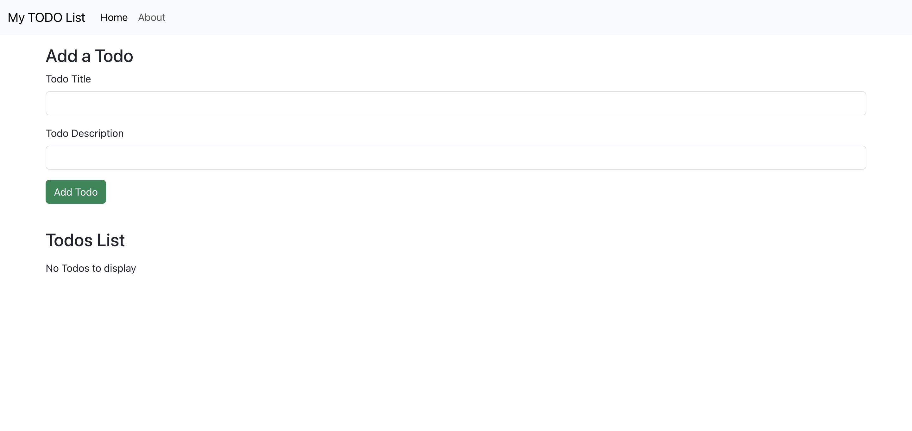

# Todo React App 🚀


# 📝 Todo React App

A simple and responsive Todo List application built using **React.js**.

---

## 🚀 Features

* ➕ Add Todos
* ❌ Delete Todos
* 💾 Data stored using localStorage
* ⚡ Fast and responsive UI

---

## 🛠️ Tech Stack

* React.js
* Bootstrap
* JavaScript
* HTML/CSS

---

## 📦 Installation

```bash
git clone https://github.com/AakashSingh07/todo-react-app.git
cd todo-react-app
npm install
npm start
```

---

## 📸 Screenshots


---

## 🌐 Live Demo

(Will add after deployment)

---

## 👨‍💻 Author

Aakash Singh
